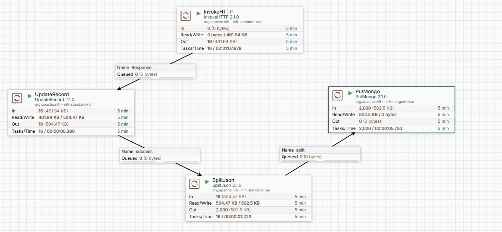

# APACHE NIFI - BASIC DATAFLOW

## Mục tiêu
Ứng dụng này hỗ trợ tìm kiếm vé máy bay và tra cứu giá vé, thực hiện quy trình ETL (Extract, Transform, Load) để thu thập, xử lý và lưu trữ dữ liệu từ nguồn trực tuyến vào MongoDB, qua đó phục vụ việc tìm kiếm và phân tích biến động giá vé máy bay.

## Quy trình thực hiện

1. **Thu thập dữ liệu (Extract)**:
    - Thu thập thông tin chuyến bay từ trang web: [Vietnam Airport](https://www.vietnamairport.vn/thong-tin-lich-bay).
    - Các trường dữ liệu cần thu thập:
      - `scheduled_time`: Giờ dự kiến.
      - `estimated_time`: Giờ ước tính.
      - `route`: Lộ trình bay (ví dụ: VCA → HAN).
      - `flight_no`: Số hiệu chuyến bay.
      - `carrier`: Hãng hàng không (ví dụ: VJ).
      - `cki_row`: Hàng làm thủ tục.
      - `gate`: Cổng ra máy bay.
      - `terminal`: Sảnh terminal.
      - `status`: Trạng thái chuyến bay.
      - `crawled_time`: Giờ thu thập dữ liệu.

2. **Xử lý và chuẩn hóa dữ liệu (Transform)**:
    - Dữ liệu thu thập cần được xử lý và chuẩn hóa, bao gồm việc thêm cột `crawled_time` để ghi lại thời gian thu thập dữ liệu.

3. **Lưu trữ dữ liệu (Load)**:
    - Dữ liệu được lưu vào MongoDB để phục vụ việc tìm kiếm và tra cứu thông tin chuyến bay.

## Công cụ và công nghệ sử dụng
- **Apache NiFi**: Dùng để tạo quy trình ETL tự động hóa từ thu thập, xử lý đến lưu trữ dữ liệu.
- **Docker và Docker Compose**: Sử dụng Docker Image của NiFi và MongoDB để thiết lập môi trường làm việc. (nếu chưa học về Docker, mình đã có upload [tại đây]("https://github.com/HTAnh2003/Big-Data") để tìm hiểu).
- **MongoDB**: Cơ sở dữ liệu lưu trữ dữ liệu đã thu thập.

## Các bước triển khai

1. **Tạo Pipeline ETL**:
    - **Extract**: Thu thập dữ liệu từ nguồn [Vietnam Airport](https://www.vietnamairport.vn/thong-tin-lich-bay).
    - **Transform**: Xử lý và chuẩn hóa dữ liệu (thêm cột `crawled_time`).
    - **Load**: Lưu dữ liệu vào MongoDB.

2. **Sử dụng Docker Compose**:
    - Chạy NiFi và MongoDB bằng Docker Compose để thiết lập môi trường làm việc.

## Kết quả mong đợi
- Hoàn thành pipeline ETL trên NiFi.
- Xác minh dữ liệu được lưu đúng định dạng trong MongoDB.
- Có thể tìm kiếm và tra cứu thông tin chuyến bay dựa trên các tiêu chí như giờ dự kiến, số hiệu chuyến bay, lộ trình, v.v.

## Pipeline ETL trên Apache NiFi
- **Extract**: Sử dụng Processor `InvokeHTTP` để gửi yêu cầu HTTP đến trang web [Vietnam Airport](https://www.vietnamairport.vn/thong-tin-lich-bay) và lấy dữ liệu thông tin chuyến bay.
- **Transform**: Sử dụng Processor `UpdateAttribute` để thêm cột `crawled_time` với giá trị là thời gian hiện tại.
- **Load**: Sử dụng Processor `PutMongo` để lưu dữ liệu vào MongoDB. (Sử dụng `SplitJson` để chia dữ liệu thành từng bản ghi riêng lẻ trước khi lưu vào MongoDB).

    [](images/pipeline.jpg)

## Các vấn đề có thể gặp phải
- **Test API**:  
  Để kiểm tra API, có thể sử dụng curl 
    ```bash
    curl "https://www.vietnamairport.vn/vi/action/flight_plan_filter?airport=&flight_date=2025-01-14&flight_no=&to_airport=&carrier=&status="
    ```
- **Truy cập vào Apache NiFi**:  
  Để truy cập giao diện người dùng NiFi, truy cập đường dẫn: `https://localhost:8443/nifi/`.
- **Kiểm tra tài khoản và mật khẩu để đăng nhập vào NiFi**:  
  Sau khi chạy NiFi container, kiểm tra tài khoản và mật khẩu được tự động sinh ra bằng lệnh:
  ```bash
  docker logs <container_nifi> | grep Generated
  ```
  Hoặc vào kiểm tra file log tại `/nifi/logs/nifi-app.log`.
- **Lỗi kết nối giữa NiFi và MongoDB**:  
  Kiểm tra cấu hình kết nối trong `PutMongo` processor, đảm bảo thông tin về MongoDB chính xác và MongoDB đang chạy trên đúng cổng (mặc định là 27017).
- **Lỗi khi thu thập dữ liệu**:  
  Đảm bảo rằng URL API được sử dụng trong processor `InvokeHTTP` có cú pháp đúng và Expression Language (`${now():format('yyyy-MM-dd')}`) được cấu hình chính xác.
- **Bị mất flow khi restart NiFi**:  
  Để tránh mất flow khi restart NiFi, cần lưu lại flow của pipeline ETL hoặc mount volume cho container NiFi để lưu trữ flow file ở ngoài container.

## Tài liệu tham khảo
- [Apache NiFi Documentation](https://nifi.apache.org/nifi-docs)
- [MongoDB](https://www.mongodb.com/)
- [Docker](https://www.docker.com/)
- [Docker Compose](https://docs.docker.com/compose/)
- [Vietnam Airport](https://www.vietnamairport.vn/thong-tin-lich-bay)
- [Hướng dẫn của thầy Thành](lab1-apache-nifi.pdf)

